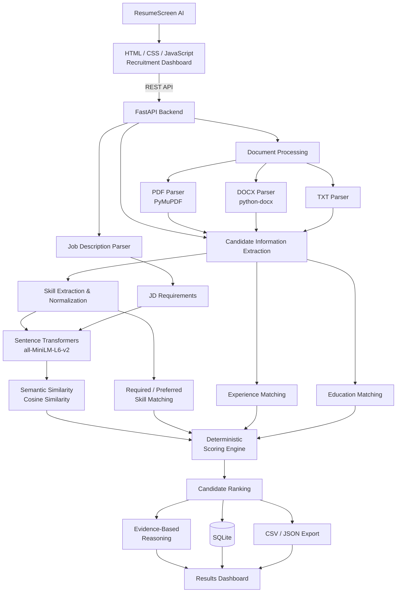

# ResumeScreen AI

ResumeScreen AI is a local, privacy-conscious resume screening application for ranking candidates against a job description. It uses deterministic, inspectable scoring and works without a paid API.

## Features

- PDF, DOCX, and TXT parsing with validation and useful errors
- Batch semantic matching using `all-MiniLM-L6-v2` (with a local fallback if unavailable)
- Case-insensitive skill extraction, experience and education matching
- SQLite screening history; CSV and JSON exports
- Vanilla HTML/CSS/JS recruitment dashboard with search, filters, sorting and detail modal
- Ten varied sample resumes and a Python backend job description

## Architecture

`Frontend → FastAPI /api/analyze → parsing → JD/candidate extraction → batched embeddings → deterministic scoring → ranking/reasoning → SQLite → dashboard/export`

The optional `GROQ_API_KEY` is intentionally not required. The shipped reasoning service produces evidence-bound templates; this keeps results reproducible and avoids an external dependency.

## Setup and run

cd D:\VS-Studio\resume-screening-agent

py -3.10 -m venv .venv
.\.venv\Scripts\Activate.ps1
python --version
pip install -r requirements.txt
uvicorn backend.main:app --reload

## Sample input

Paste `data/sample_jd/python_backend_jd.txt or Sample Job Description — Junior AI Engineer.txt` and select the ten files under `data/sample_resumes/`. The files represent strong through low matches.

## Scoring methodology

Final score (0–100) is deterministic:

`0.40 × semantic similarity + 0.30 × required skill coverage + 0.15 × experience + 0.10 × education + 0.05 × preferred skill coverage`

Semantic similarity is cosine similarity of MiniLM embeddings. Required and preferred skill coverage are exact normalized dictionary matches. Experience is capped at 100% when stated years meet the JD requirement; absent evidence receives a neutral 50% rather than an invented value. Education is not penalized when the JD does not specify it. Recommendations: Strong ≥80, Good ≥65, Moderate ≥45, Low <45.

## Testing

```powershell
pytest -q
```

Tests cover parser basics, skills/normalization, scoring/ranking, health, and a ten-resume upload run. The API test mocks embeddings so it stays fast and offline.

## Design decisions and limitations

The extractor deliberately uses transparent rules rather than opaque candidate inference. Scanned/image-only PDFs and unusual resume layouts may yield little text; complex career duration calculation is approximated with stated “N years experience” phrases. The shipped optional reasoning layer is deterministic; connect a Groq client only if externally generated wording is needed, while preserving the calculated score.

## Architecture



## Suggested commits

1. `chore: scaffold ResumeScreen AI project`
2. `feat: add parsing extraction and transparent scoring`
3. `feat: add FastAPI persistence exports and dashboard`
4. `test: cover parser scoring and batch analysis`
